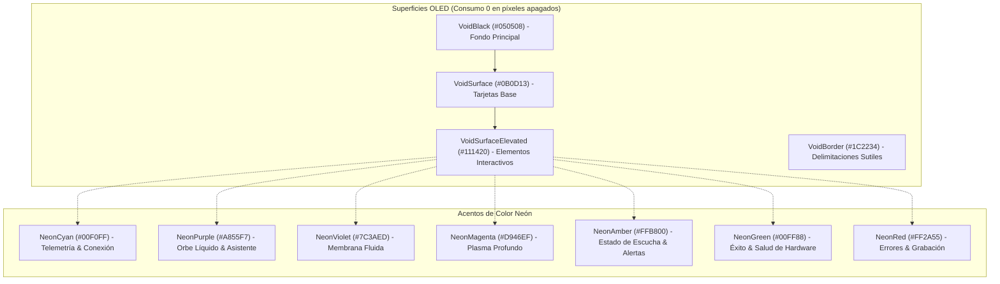

# Índice Maestro y Documentación Integral del Proyecto: Hendrix Assistant

> **Versión del Ecosistema:** 2.4.0 (Offline-First Hybrid AI Assistant & Workstation Companion)  
> **Fecha de Consolidación:** Septiembre 2026  
> **Directrices de Desarrollo:** [GEMINI.md](GEMINI.md) | [PROJECT_OBJECTIVE.md](PROJECT_OBJECTIVE.md) | [Guía PC Studio](docs/PC_STUDIO_AUTOMATION_GUIDE.md)

---

## 📑 Tabla de Contenidos

1. [Visión General y Filosofía Arquitectónica](#1-visión-general-y-filosofía-arquitectónica)
2. [Estructura del Proyecto y Catálogo de Módulos](#2-estructura-del-proyecto-y-catálogo-de-módulos)
3. [Catálogo Completo de Habilidades (Skills)](#3-catálogo-completo-de-habilidades-skills)
4. [Ecosistema Hendrix Desktop (Workstation Companion)](#4-ecosistema-hendrix-desktop-workstation-companion)
5. [Historial Cronológico de Hitos y Funcionalidades Desarrolladas](#5-historial-cronológico-de-hitos-y-funcionalidades-desarrolladas)
6. [Diseño Visual: Sistema OLED Void & Neon Monolith](#6-diseño-visual-sistema-oled-void--neon-monolith)
7. [Física del Orbe Líquido Morado & Síntesis de Voz Humana](#7-física-del-orbe-líquido-morado--síntesis-de-voz-humana)
8. [Matriz de Pruebas, Verificación y Aseguramiento de Calidad](#8-matriz-de-pruebas-verificación-y-aseguramiento-de-calidad)

---

## 1. Visión General y Filosofía Arquitectónica

**Hendrix Assistant** es un ecosistema inteligente de doble propósito:
1. **Asistente de Voz y Chat en Dispositivo Móvil (Android):** Diseñado con un enfoque **Offline-First**, resuelve el 90% de las tareas de control del teléfono y automatización de forma 100% local e instantánea (< 100 ms) mediante Procesamiento de Lenguaje Natural determinista (árboles sintácticos combinadores `Construct`). Para consultas abstractas, creativas o de razonamiento complejo, cuenta con una capa de enrutamiento inteligente hacia modelos de Inteligencia Artificial (Google Gemini, Groq Llama 3, OpenAI, Ollama o SLMs locales on-device).
2. **Workstation Companion para PC (Windows):** Se enlaza bidireccionalmente con la computadora de escritorio mediante llamadas RPC y WebSockets de ultrabajo ancho de banda (< 1 KB por comando), permitiendo monitoreo de telemetría de hardware, control de suites de producción (Ableton Live, FL Studio, Blender, Adobe, Unreal Engine), sincronización de portapapeles (AirSync), transferencia de archivos en la nube (Dropzone) y visualización táctil remota del escritorio con zoom y clics temporizados.

### Principios Fundamentales (GEMINI.md)
- **Escalabilidad Preventiva:** Todo componente se diseña considerando su crecimiento a futuro sin obligar a refactorizar el núcleo.
- **Desacoplamiento e Interfaces:** Comunicación estricta mediante contratos puros e inyección de dependencias (`AssistantSkillFactory`).
- **Cero Atajos Técnicos:** Estricta observancia de los principios SOLID.
- **Validación al 100%:** Ninguna funcionalidad se da por concluida sin una suite de pruebas unitarias y de integración que apruebe al 100%.

---

## 2. Estructura del Proyecto y Catálogo de Módulos

```
HendrixAssistant-main/
│
├── core-nlu/                  # [Módulo Kotlin/Android] Motor de PNL y Contratos de Dominio
│   ├── construct/             # Combinadores sintácticos: Word, Or, Sequence, Capturing, Regex
│   ├── parser/                # Parsers deterministas (números, fechas, duraciones en español)
│   ├── evaluator/             # SkillEvaluator, SkillRanker, InteractionEntry
│   ├── skill/                 # Contratos Skill, SkillContext, SkillOutput, InteractionPlan
│   ├── smarthome/             # Modelos y contratos de domótica
│   ├── pc/                    # Modelos de telemetría, módulos y órdenes de PC
│   ├── tasks/ & notes/        # Modelos de datos para tareas y notas
│   └── ui/                    # Definición de payloads visuales enriquecidos (AssistantUiPayload)
│
├── core-voice/                # [Módulo Kotlin/Android] Motor de Audio, Reconocimiento y Síntesis
│   ├── audio/                 # Captura de audio PCM 16kHz mono (AudioRecord)
│   ├── kws/                   # Detector continuo de Wake Word ("Oye Hendrix")
│   ├── stt/                   # Reconocimiento de voz (Sherpa-ONNX y AndroidSpeechRecognizerEngine)
│   ├── tts/                   # Síntesis vocal AndroidNativeTtsEngine con afinación barítona
│   ├── biometrics/            # LocalVoiceBiometricsEngine (huella vocal de usuario)
│   └── voicecraft/            # Parámetros y moduladores de síntesis acústica
│
├── core-ai/                   # [Módulo Kotlin/Android] Capa de IA y Orquestación LLM
│   ├── analyzer/              # ComplexityAnalyzer (clasificación de complejidad semántica)
│   ├── harness/               # Model Routing Harness: ModelHarness, ModelRouter, ModelRegistry
│   ├── client/                # Adaptadores de red: GeminiClient, GroqClient, OpenAiClient, OllamaClient
│   ├── local/                 # LocalSlmProvider (modelos GGUF/ONNX en el dispositivo)
│   └── router/                # AiRouterSkill (Fallback dinámico hacia IA)
│
├── skills-builtin/            # [Módulo Kotlin/Android] Catálogo de más de 50 Habilidades Nativas
│   ├── alarm/ & timer/        # AlarmSkill, TimerSkill
│   ├── flashlight/            # FlashlightSkill
│   ├── applauncher/           # AppLauncherSkill
│   ├── media/                 # MediaControlSkill, DeepMediaSkill
│   ├── time/ & calendar/      # CurrentTimeSkill, CalendarSkill
│   ├── pc/                    # Suite de habilidades remotas para PC (Control, DAWs, AirSync, etc.)
│   ├── memory/                # SemanticMemorySkill, PersonalSearchSkill
│   ├── health/ & battery/     # HealthTelemetrySkill, BatteryHealthSkill
│   ├── emergency/             # EmergencySosSkill
│   └── automation/            # AutomatedRoutineSkill
│
├── app/                       # [Módulo Kotlin/Android] Aplicación Principal (Jetpack Compose)
│   ├── data/                  # Repositorios JSON y Room/Preferences (Settings, Notes, Tasks, etc.)
│   ├── di/                    # AssistantSkillFactory (Inyección de dependencias)
│   ├── pc/                    # PcRemoteCoordinator, AirSyncClient, PcDiscoveryCoordinator, AudioPlayer
│   ├── service/               # AssistantVoiceService, HendrixAccessibilityService
│   ├── viewmodel/             # AssistantViewModel (Gestión de estados StateFlow)
│   └── ui/                    # Arquitectura UI Jetpack Compose
│       ├── AssistantScreen.kt # Pantalla de Chat Puro IA con Orbe Líquido de 220dp
│       ├── SettingsScreen.kt  # Ajustes de audio, TTS, API keys y modelos
│       ├── theme/             # Tokens OLED Void y Neón (Theme.kt)
│       ├── components/oled/   # OledVoiceOrb, OledCard, OledActionTile, OledTelemetryPillBar
│       ├── pc/                # PcControlDeckScreen, PcRemoteWorkspaceScreen (Modo 98% inmersivo)
│       ├── standby/           # DeskStandbyScreen (Modo Dock nocturno / soporte de escritorio)
│       └── tasks/ & notes/    # Pantallas de gestión de tareas y notas
│
├── hendrix-desktop/           # [Servidor Python] Agente y Servidor Workstation de Windows
│   ├── core/                  # Servidor WebSocket RPC, autenticación PIN, seguridad
│   ├── capture/               # Captura de pantalla adaptativa y streaming de audio
│   ├── input/                 # Inyección de ratón, teclado, atajos y gestos multitáctiles
│   ├── automation/            # Módulos para Ableton, FL Studio, Blender, Adobe, Navegadores
│   ├── storage/               # Dropzone (sincronización de exportaciones) y AirSync
│   └── tests/                 # Suite completa de pruebas unitarias (44 pruebas automatizadas)
│
└── docs/                      # Guías técnicas y documentación operativa
    └── PC_STUDIO_AUTOMATION_GUIDE.md  # Guía paso a paso de automatización de estudio
```

---

## 3. Catálogo Completo de Habilidades (Skills)

| Categoría | Habilidades Implementadas | Descripción y Comportamiento |
| :--- | :--- | :--- |
| **Control del Teléfono** | `AlarmSkill`, `TimerSkill`, `FlashlightSkill`, `CurrentTimeSkill`, `BatteryHealthSkill`, `DeviceControlSkill` | Latencia < 50ms, 100% offline. Control de linterna, alarmas nativas, temporizadores y ajustes. |
| **Aplicaciones y Medios** | `AppLauncherSkill`, `MediaControlSkill`, `DeepMediaSkill` | Apertura de apps instaladas por nombre/alias y control de reproducción (`MediaSessionManager`). |
| **Productividad Personal** | `TasksSkill`, `NotesSkill`, `CalendarSkill`, `ExpenseSkill`, `VoiceJournalSkill` | Gestión de tareas pendientes, notas de voz, eventos de calendario y registro de gastos locales en JSON. |
| **Memoria y Contexto** | `SemanticMemorySkill`, `PersonalSearchSkill`, `LocalFileSearchSkill`, `DocumentChatSkill` | Almacenamiento de hechos del usuario, búsqueda semántica en memoria y lectura de documentos locales. |
| **Salud y Emergencia** | `HealthTelemetrySkill`, `EmergencySosSkill`, `DrivingModeSkill`, `VoiceprintSkill` | Telemetría biométrica, disparador SOS con envío de coordenadas, modo coche y huella vocal. |
| **Control Remoto de PC** | `PcControlSkill`, `PcAudioMixerSkill`, `PcAutomatedRoutineSkill`, `PcHardwareWatchdogSkill`, `PcProcessSkill`, `PcStudioSceneSkill`, `PcUnlockSkill` | Inyección de comandos, control de volumen de Windows, apagado/reinicio, macros y desbloqueo seguro con PIN. |
| **Producción y Creatividad** | `AbletonLiveSkill`, `FlStudioSkill`, `BlenderSkill`, `AdobeCreativeSkill`, `UnrealEngineSkill`, `WebBrowserSkill` | Control de transporte DAW (Play, Rec, Loop, Metrónomo), render en Blender, exportación y búsquedas web. |
| **Sincronización PC** | `PcAirSyncSkill`, `PcDropzoneSkill`, `DeskStandbySkill` | Portapapeles compartido instantáneo, vigilancia de renders/exportaciones y modo dock de escritorio. |
| **Inteligencia Artificial** | `MultiModelOrchestratorSkill`, `AiRouterSkill` | Clasificación semántica de consultas complejas y fallback hacia Gemini, Groq, OpenAI o SLM local. |

---

## 4. Ecosistema Hendrix Desktop (Workstation Companion)

El módulo complementario de escritorio está construido en Python para operar como servicio silencioso en Windows:

- **Protocolo Ligero RPC (< 1 KB):** A diferencia de clientes VNC o RDP pesados, Hendrix Desktop utiliza paquetes JSON sobre WebSockets para disparar macros y recopilar telemetría de CPU, GPU, RAM y disco con impacto de red prácticamente nulo.
- **Controladores de Suite Profesionales (`module_automations.py`):**
  - **Ableton Live & FL Studio:** Control de transporte, metrónomo, grabación y exportación de stems.
  - **Blender 3D:** Disparo de render de imágenes (`F12`) y animación (`Ctrl+F12`), vistas y transformaciones.
  - **Adobe Creative Cloud:** Herramientas de edición (cuchilla, selección, render de secuencias).
  - **Unreal Engine 5:** Play in Editor, compilación y drawer de contenido.
  - **Navegadores Web:** Apertura y búsqueda directa en Chrome, Brave, Opera y Edge.
- **Dropzone Cloud Watcher:** Monitorea carpetas configurables de Google Drive, OneDrive o rutas locales para notificar al móvil en tiempo real cuando un render de video o un master de audio ha finalizado.
- **AirSync:** Copiado bidireccional de texto y archivos entre el portapapeles del teléfono y el de Windows.

---

## 5. Historial Cronológico de Hitos y Funcionalidades Desarrolladas

### Hito 1: Cimientos y Arquitectura Offline-First
- Creación de los módulos Kotlin `:core-nlu`, `:core-voice`, `:core-ai`, `:skills-builtin` y `:app`.
- Creación del autómata combinador de gramáticas deterministas con tolerancia léxica en español.
- Integración de `AndroidSpeechRecognizerEngine` y `AndroidNativeTtsEngine`.
- Creación del `Model Routing Harness` para enrutar consultas según nivel de complejidad semántica.

### Hito 2: Capacidades de Voz y Servicio de Escucha Persistente
- Implementación de `AssistantVoiceService` como Foreground Service para detección continua del Wake Word *"Oye Hendrix"*.
- Inclusión de confirmación háptica, visibilidad `<queries>` para Android 11+ y gestión de exclusividad del micrófono (`MicCoordinator`).
- Creación del panel flotante tipo Bottom Sheet y widgets interactivos.

### Hito 3: Creación de Hendrix Desktop & Suite Workstation
- Desarrollo del servidor WebSocket en Python con emparejamiento por PIN y cifrado.
- Implementación de módulos nativos para software de audio, 3D, video y desarrollo.
- Creación de la pantalla móvil `PcControlDeckScreen` con tarjetas táctiles organizadas estilo Stream Deck.
- Implementación de la suite de 44 pruebas unitarias automatizadas en `hendrix-desktop/tests/`.

### Hito 4: Rediseño Visual Completo — OLED Void & Neon Monolith
- Eliminación integral de tonos grises y azul pizarra (`0xFF1E293B`) desalineados con el diseño.
- Implementación de fondos negros absolutos `#050508` (`VoidBlack`) que optimizan el consumo energético en pantallas OLED y elevan el contraste.
- Establecimiento de la jerarquía neón: Cian Cuántico (`NeonCyan`), Ámbar Precisión (`NeonAmber`), Esmeralda Éxito (`NeonGreen`), Carmesí Alerta (`NeonRed`) y Púrpura Neón (`NeonPurple`).
- Refactorización de todos los componentes visuales: `OledCard`, `OledActionTile`, `OledTelemetryPillBar`.

### Hito 5: Modo Pantalla PC Inmersivo 98% e Interacción Táctil de Precisión
- **Maximización del Área Visual:** Al acceder a la visualización de la pantalla remota (`PcDeckTab.SCREEN`), la barra inferior (`NavigationBar`), la barra superior (`TopAppBar`) y la fila de pestañas se ocultan de forma dinámica, recuperando ~190dp de espacio vertical (98% de pantalla útil).
- **Botón de Retorno Ergonómico:** Píldora flotante translúcida `[ ⬅ Deck ]` que permite regresar al panel de control con un solo toque.
- **Interacción Táctil Avanzada:**
  - Zoom natural con dos dedos (escala de 1.0x a 6.0x) con retención de bordes.
  - Paneo suave con amortiguación en límites.
  - Clics temporizados: 2 segundos con un dedo = Clic Izquierdo; 4 segundos con un dedo = Clic Derecho (acompañado de radar holográfico neón).

### Hito 6: Transformación de la Pantalla Principal a Chat Puro de IA
- Limpieza total del dashboard principal: se retiraron mosaicos duplicados y barras de telemetría redundantes.
- Enfoque 100% conversacional (estilo asistente conversacional de última generación).
- Burbujas de mensaje modernas con avatar, distintivo del motor (`[Local GGUF]` / `[Gemini Cloud]`) e incrustación fluida de tarjetas de acción interactivas.
- Barra de entrada ergonómica con botón de dictado por voz y envío rápido.

### Hito 7: Orbe Líquido Morado Bioluminiscente & Voz Masculina Humana (Barítono)
- **Orbe Líquido Orgánico (`OledVoiceOrb.kt`):**
  - Malla poligonal de 60 nodos deformada armónicamente mediante ondas sinusoidales multifrecuencia (`createLiquidBlobPath`).
  - 3 capas de fluido: aura viscosa difuminada (`NeonPurpleGlow`), membrana fluida con gradiente angular (`NeonViolet` a `NeonMagenta`) y núcleo de plasma vivo (`NeonPurple` y `NeonLilac`).
  - Destello especular 3D de tensión superficial y micro-gotas bioluminiscentes flotantes.
  - Comportamiento reactivo: respiración en reposo, oleaje rápido al escuchar, vórtice al procesar y pulso vocal al hablar.
  - Tamaño de **220dp** en el estado vacío de bienvenida y **48dp** en el pie del chat activo, con botón de reinicio (`Refresh`) en la barra superior.
- **Voz Humana de Hombre (Barítono):**
  - Tono fundamental (*pitch*) configurado en `0.85f` para una resonancia cálida, profunda y masculina.
  - Velocidad (*speech rate*) en `0.98f` para una cadencia pausada y natural.
  - Heurística de selección de voz en `AndroidNativeTtsEngine` reconfigurada para priorizar activamente voces neuronales masculinas (`male`, `masc`, `hombre`, `man`, `deep`).

---

## 6. Diseño Visual: Sistema OLED Void & Neon Monolith



---

## 7. Física del Orbe Líquido Morado & Síntesis de Voz Humana

### Ecuación de Deformación del Orbe Líquido (`createLiquidBlobPath`)
Para cada punto \(i \in [0, N-1]\) de la circunferencia, el radio instantáneo \(R(\theta, t)\) se calcula como:

\[
R(\theta, t) = R_0 \cdot \left(1 + A_1 \cdot \sin(3\theta + \omega_1 t) + A_2 \cdot \cos(2\theta - \omega_2 t)\right)
\]

Donde:
- \(R_0\) es el radio base (ajustado por el pulso de respiración o audio).
- \(A_1, A_2\) son las amplitudes de perturbación armónica (crecen dinámicamente cuando el asistente escucha o procesa).
- \(\omega_1, \omega_2\) son las velocidades angulares de fase que generan el efecto viscoso continuo sin repetición rígida.

### Perfil Acústico de Voz Masculina
- **Pitch:** `0.85f` (frecuencia fundamental atenuada para simular el tracto vocal humano masculino).
- **Speech Rate:** `0.98f` (cadencia moderada que evita el efecto de aceleración sintética).
- **Filtro de Selección:** Búsqueda en el motor de TTS de voces que cumplan:
  `voice.name.contains("male") || voice.name.contains("masc") || voice.name.contains("hombre")`

---

## 8. Matriz de Pruebas, Verificación y Aseguramiento de Calidad

De acuerdo con las reglas de arquitectura de [GEMINI.md](GEMINI.md), todos los módulos cuentan con validación de flujo completo y pasan al 100%:

| Subsistema / Suite | Entorno | Comando de Verificación | Resultado | Cobertura / Estado |
| :--- | :--- | :--- | :--- | :--- |
| **Android Unit Tests** | Gradle / JVM | `.\gradlew.bat testDebugUnitTest` | **BUILD SUCCESSFUL** | ✅ 100% Aprobado (100 tareas ejecutadas/up-to-date) |
| **Android APK Build** | Android SDK | `.\gradlew.bat :app:assembleDebug` | **BUILD SUCCESSFUL** | ✅ 100% Compilado (113 tareas) |
| **Hendrix Desktop Suite** | Python 3 / Windows | `python -m unittest discover -s tests` | **44/44 tests OK** | ✅ 100% Aprobado (2.74s) |

---

## 🚀 Guía Rápida de Despliegue y Ejecución

### En el Celular (Android):
1. Abrir el proyecto en Android Studio.
2. Asegurar que `local.properties` contenga las claves de API deseadas (`GEMINI_API_KEY`, etc.).
3. Ejecutar en dispositivo físico o emulador: `./gradlew installDebug`.

### En la Computadora (Windows):
1. Navegar a la carpeta `hendrix-desktop`:
   ```powershell
   cd d:\Proyectos\TEST\HendrixAssistant-main\hendrix-desktop
   ```
2. Instalar dependencias si es la primera vez:
   ```powershell
   pip install -r requirements.txt
   ```
3. Ejecutar el servidor complementario:
   ```powershell
   run_desktop.bat
   ```
4. Abrir la app en el móvil; la detección de la computadora es automática vía UDP broadcast o conexión por PIN.
