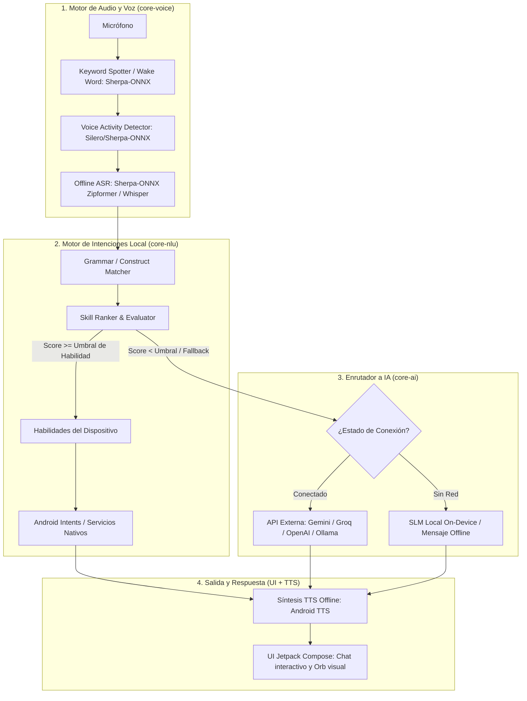

# Asistente Celular Offline-First (AI Hybrid Voice Assistant)
**Documento Maestro de Objetivos, Arquitectura y Reglas de Diseño**

> **Propósito de este documento:**  
> Este archivo es la **fuente única de verdad** para el desarrollo y mantenimiento del proyecto. Define los objetivos, la filosofía de diseño, la división de responsabilidades y las decisiones técnicas para que nunca se desvíe el propósito de la aplicación en ninguna fase futura.

---

## 1. Visión y Objetivo Principal

Crear un asistente de voz para Android diseñado bajo la filosofía **Offline-First**, que combina:
1. **Un motor local de PNL y habilidades deterministas (inspirado en [Dicio](https://github.com/Stypox/dicio-android)):**  
   Procesa el 80-90% de las órdenes cotidianas (alarmas, temporizadores, linterna, apertura de aplicaciones, control de medios, hora, cálculos, ajustes del sistema) de forma **instantánea (< 100 ms)**, privada y **100% sin conexión a internet**.
2. **Reconocimiento y síntesis de voz en el dispositivo (inspirado en [Sherpa-ONNX](https://github.com/k2-fsa/sherpa-onnx)):**  
   Detección de palabra clave (*Wake Word / Keyword Spotting*), detección de actividad vocal (*VAD*) y transcripción de voz a texto (*Offline ASR*) completamente locales, complementado con el sintetizador nativo de Android (*Android TTS*) o Piper neural TTS.
3. **Capa de Enrutamiento Inteligente a IA (LLM / SLM Fallback):**  
   Cuando el usuario realiza una consulta abierta, compleja, de razonamiento o fuera del dominio de las habilidades locales (ej. *"explícame la física cuántica"*, *"redáctame un correo formal"*, *"compara estos dos productos"*), el motor local detecta la falta de coincidencia o la complejidad semántica y **escala automáticamente la tarea a un modelo de Inteligencia Artificial** (API en la nube como Gemini/Groq/OpenAI o un SLM local como Gemma/SmolLM si el hardware lo soporta).

---

## 2. Reglas Inmutables de Diseño

- **Regla 1: Latencia Cero para Acciones del Dispositivo.**  
  Nunca se debe invocar una IA generativa o una API remota para encender la linterna, poner una alarma o consultar la hora. Las acciones del dispositivo se resuelven localmente por el árbol sintáctico.
- **Regla 2: Privacidad por Defecto.**  
  El audio del usuario nunca se envía a servidores externos para tareas locales. Solo el texto transcrito de consultas no reconocibles o de razonamiento complejo se envía a la API de IA configurada, con consentimiento explícito del usuario.
- **Regla 3: Modularidad Extensible de Habilidades (Skills).**  
  Toda nueva capacidad del dispositivo debe implementarse como una clase `Skill` desacoplada con su propia gramática y puntuación (`Score`).
- **Regla 4: Degradación Elegante (Graceful Fallback).**  
  Si no hay conexión a internet y se pide una tarea que requiere IA remota, el sistema debe informar claramente al usuario sin fallar ni bloquearse, sugiriendo alternativas locales.
- **Regla 5: Escalabilidad Preventiva y Diseño a Futuro.**  
  Toda funcionalidad, módulo, interfaz o modelo de datos debe ser concebido anticipando que crecerá significativamente en complejidad o alcance. Se prohíben atajos técnicos o acoplamientos rígidos que fuercen refactorizaciones estructurales futuras.

---

## 3. Arquitectura del Sistema

---

## 4. Estructura de Módulos

El proyecto está organizado en una arquitectura modular limpia en Kotlin:

1. `:core-nlu`
   * Motor sintáctico de coincidencia con autómata combinador de gramáticas (`Construct`, `WordConstruct`, `OrConstruct`, `OptionalConstruct`, `CapturingConstruct`).
   * Evaluador y clasificador de habilidades (`SkillEvaluator`, `SkillRanker`).
   * Tipos de retorno (`SkillOutput`, `InteractionPlan`, `Score`).
2. `:core-voice`
   * Abstracciones de audio (`SttEngine`, `TtsEngine`, `WakeWordEngine`).
   * Adaptadores para **Sherpa-ONNX** (ASR, KWS, VAD).
   * Motor nativo `AndroidSpeechRecognizerEngine` para reconocimiento de voz inmediato y fiable en dispositivo.
   * Adaptador para `AndroidTextToSpeech` nativo.
3. `:core-ai`
   * Enrutador de Fallback (`AiRouterSkill`).
   * **Model Routing Harness (`ModelHarness`, `ModelRouter`, `ModelRegistry`):** Enrutador dinámico que clasifica la complejidad de la consulta y delega al modelo más idóneo (Gemini Flash vs Pro vs Thinking) con tolerancia a fallos.
   * Analizador de complejidad de peticiones (`ComplexityAnalyzer`).
   * Clientes para proveedores de LLM (`LlmClient`: Gemini, OpenAI, Groq, servidores locales Ollama).
   * Soporte para modelos pequeños locales en el dispositivo (`LocalSlmProvider`).
4. `:skills-builtin`
   * Habilidades nativas en español:
     * `AlarmSkill`: Gestión de alarmas (`AlarmClock.ACTION_SET_ALARM`).
     * `TimerSkill`: Temporizadores.
     * `FlashlightSkill`: Linterna / Torch vía `CameraManager`.
     * `AppLauncherSkill`: Apertura de aplicaciones instaladas por nombre/alias.
     * `MediaControlSkill`: Reproducir, pausar, saltar canciones vía `MediaSessionManager`.
     * `CurrentTimeSkill`: Información horaria y de fecha.
     * `DeviceControlSkill`: Volumen, brillo, WiFi.
5. `:app`
   * Aplicación Android principal con Jetpack Compose y Material 3.
   * `SettingsRepository`: Persistencia en `SharedPreferences` para estado de segundo plano, API keys y preferencias.
   * `AssistantScreen`: Interfaz visual con visualizador de voz, diálogo interactivo y badges del Harness.
   * `SettingsScreen`: Configuración de claves de API, conmutador del Harness, selección de motor y sensibilidad.
   * `AssistantVoiceService`: Servicio en primer plano para escucha persistente de "Oye Hendrix".

---

## 5. Referencias de los Repositorios Base

- **[Dicio Android (stypox/dicio-android)](https://github.com/Stypox/dicio-android):**
  - Mapeo de `Skill`, `SkillContext`, `SkillEvaluator`, `SkillRanker`.
  - Estructura de `StandardRecognizerSkill` y gramáticas de patrones en español.
  - Gestión de planes de interacción multiturno (`InteractionPlan`).
- **[Sherpa-ONNX (k2-fsa/sherpa-onnx)](https://github.com/k2-fsa/sherpa-onnx):**
  - Detección de palabra clave (`SherpaOnnxKws`).
  - Reconocimiento por voz con detección de silencio (`SherpaOnnxVadAsr`).
  - Modelos cuantizados en formato ONNX ligeros para CPU/NPU de dispositivos móviles.

---

## 6. Historial de Decisiones y Estado de Implementación

| Fecha | Decisión / Hito | Estado |
|---|---|---|
| 2026-09-13 | Definición del objetivo y arquitectura híbrida NLU + Sherpa-ONNX + Fallback LLM | Aprobado |
| 2026-09-13 | Creación del documento maestro `PROJECT_OBJECTIVE.md` | Completado |
| 2026-09-13 | Implementación de módulos `:core-nlu`, `:core-voice`, `:core-ai`, `:skills-builtin`, `:app` | Completado |
| 2026-09-13 | Formalización de la Regla 5 (Escalabilidad Preventiva y Diseño a Futuro vía `/learn`) | Activo y Permanente |
| 2026-09-13 | Implementación de AndroidSpeechRecognizerEngine, SettingsRepository y Model Routing Harness | Completado |
| 2026-09-13 | Confirmación Háptica (Vibración), Panel Flotante Bottom Sheet y Acción Rápida en Notificación | Completado |
| 2026-09-13 | AndroidContinuousWakeWordEngine (Wake Word tolerante a fonemas) y MicCoordinator (exclusividad de micro) | Completado |
| 2026-09-13 | Visibilidad `<queries>` Android 11+ para SpeechRecognizer, recuperación de dictado y diagnóstico visual | Completado |
