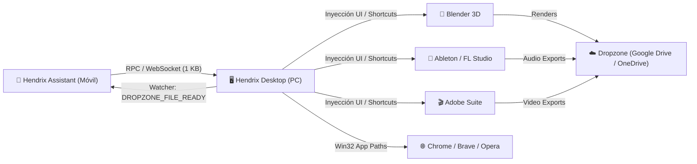

# Guía Integral de Automatización de PC Studio, Módulos y Dropzone Cloud

Esta guía documenta la arquitectura, módulos, sincronización en la nube y flujos de trabajo implementados en **Hendrix Assistant** y **Hendrix Desktop**, diseñada para operar de forma remota, táctil y por voz con suites profesionales de producción y navegación web.

---

## 📑 Tabla de Contenidos

1. [Visión General y Filosofía de Diseño](#1-visión-general-y-filosofía-de-diseño)
2. [Catálogo de Módulos y Suites Soportadas](#2-catálogo-de-módulos-y-suites-soportadas)
3. [Módulo de Navegadores Web y Búsquedas Inteligentes](#3-módulo-de-navegadores-web-y-búsquedas-inteligentes)
4. [Arquitectura Portátil de Dropzone & Cloud Sync](#4-arquitectura-portátil-de-dropzone--cloud-sync)
5. [Guía de Despliegue en la Estación de Trabajo](#5-guía-de-despliegue-en-la-estación-de-trabajo)
6. [Flujos de Trabajo Prácticos Paso a Paso](#6-flujos-de-trabajo-prácticos-paso-a-paso)
7. [Comandos de Voz Admitidos](#7-comandos-de-voz-admitidos)

---

## 1. Visión General y Filosofía de Diseño

El sistema está construido bajo dos principios fundamentales:

1. **Ahorro Extremo de Datos (Cero Streaming Obligatorio):**
   - Para controlar DAWs, modelado 3D, edición o navegación no es necesario transmitir video continuo de 60 FPS (que consume 1-2 GB por hora).
   - El **Quick Command Deck** en el móvil ofrece tarjetas de macros táctiles ergonómicas (estilo Stream Deck) y comandos de voz que transmiten paquetes RPC ligeros de menos de **1 KB** por comando.
2. **Portabilidad y Desacoplamiento (Agnóstico a la Máquina):**
   - **Cero rutas fijas en el código:** No depende de nombres de usuario locales ni discos específicos.
   - Se adapta automáticamente a cualquier computadora donde se ejecute (Google Drive, OneDrive o almacenamiento local).



---

## 2. Catálogo de Módulos y Suites Soportadas

El sistema cuenta con controladores nativos en Windows integrados en `module_automations.py`:

| Módulo / Suite | Categoría | Identificador | Atajos y Capacidades Nativas |
| :--- | :--- | :--- | :--- |
| **Ableton Live** | `AUDIO_DAW` 🎹 | `ABLETON_LIVE` | Play/Pausa (`Space`), Grabar (`F9`), Bucle (`Ctrl+L`), Metrónomo (`C`), Guardar (`Ctrl+S`), Exportar Audio (`Ctrl+Shift+R`), Nuevo Proyecto con confirmación interactiva. |
| **FL Studio** | `AUDIO_DAW` 🎹 | `FL_STUDIO` | Play/Pausa (`Space`), Grabar (`R`), Modo Song/Pattern (`L`), Metrónomo (`Ctrl+M`), Guardar (`Ctrl+S`), Exportar WAV (`Ctrl+R`), Mezclador (`F9`), Piano Roll (`F7`). |
| **Adobe Suite** | `CREATIVE_DESIGN` 🎨 | `ADOBE_CREATIVE` | Play/Stop (`Space`), Cuchilla (`C`), Selección (`V`), Ripple Delete (`Shift+Supr`), Render Secuencia (`Enter`), Exportar Video (`Ctrl+M`), Pincel (`B`), Guardar (`Ctrl+S`). |
| **Blender 3D** | `THREE_D_VFX` 🧊 | `BLENDER` | Render Imagen (`F12`), Render Animación (`Ctrl+F12`), Sombreado (`Z`), Vista Cámara (`Num 0`), Mover (`G`), Rotar (`R`), Escalar (`S`), Guardar (`Ctrl+S`). |
| **Unreal Engine 5** | `GAME_ENGINE` 🎮 | `UNREAL_ENGINE` | Play in Editor (`Alt+P`), Simular (`Alt+S`), Detener (`Esc`), Content Drawer (`Ctrl+Espacio`), Guardar Todo (`Ctrl+Shift+S`), Compilar Nivel (`Ctrl+Shift+;`), Enfocar Actor (`F`). |
| **Navegadores Web** | `WEB_INTERNET` 🌐 | `WEB_BROWSERS` | Apertura directa de Chrome, Brave, Opera, Edge; Búsqueda directa en Google, YouTube, Facebook, GitHub; Nueva pestaña (`Ctrl+T`), Cerrar pestaña (`Ctrl+W`), Recargar (`Ctrl+R`). |

---

## 3. Módulo de Navegadores Web y Búsquedas Inteligentes

El gestor [`browser_manager.py`](../hendrix-desktop/automation/browser_manager.py) optimiza la interacción web en Windows:

1. **Resolución en < 1 milisegundo:**
   - Consulta las claves del Registro de Windows `HKCU` y `HKLM\Software\Microsoft\Windows\CurrentVersion\App Paths\{exe}`.
2. **Degradación Elegante:**
   - Si solicitas *"abre brave y busca..."* pero el equipo solo tiene Google Chrome o Edge instalado, no se interrumpe el flujo: lanza Chrome/Edge y te notifica:
     > *"Brave no está instalado en este equipo; buscando en Google Chrome."*
3. **Plataformas de Búsqueda Parametrizadas:**
   - **Google:** `https://www.google.com/search?q={query}`
   - **YouTube:** `https://www.youtube.com/results?search_query={query}`
   - **Facebook:** `https://www.facebook.com/search/top?q={query}`
   - **GitHub:** `https://github.com/search?q={query}`
   - **DuckDuckGo:** `https://duckduckgo.com/?q={query}`
   - **URLs Directas:** `https://{dominio}`

---

## 4. Arquitectura Portátil de Dropzone & Cloud Sync

El gestor [`dropzone_manager.py`](../hendrix-desktop/storage/dropzone_manager.py) resuelve el almacenamiento de entregables entre la PC y el móvil:

### 4.1. Autodetección Inteligente de Nube
Al iniciarse en cualquier computadora, realiza la siguiente evaluación en orden:
1. **Google Drive for Desktop:** Revisa las letras de disco de la `A:` a la `Z:` buscando carpetas como `G:\My Drive` o `G:\Mi unidad`. Si existe, establece el Dropzone en `[Unidad de Drive]\HendrixStudio`.
2. **Google Drive Local:** Revisa `%UserProfile%\Google Drive\HendrixStudio`.
3. **OneDrive:** Revisa variables de entorno `%OneDrive%` o `%OneDriveConsumer%`. Si existe, establece el Dropzone en `%OneDrive%\HendrixStudio`.
4. **Almacenamiento Local (Fallback):** Si no hay clientes de nube activos, crea `~/HendrixStudio/Dropzone/`.

### 4.2. Sobreescritura Portable (`hendrix_config.json`)
Puedes forzar cualquier ruta personalizada creando o editando `hendrix-desktop/hendrix_config.json`:
```json
{
  "dropzone_path": "G:\\Mi unidad\\HendrixStudio"
}
```

### 4.3. Estructura Automática de Carpetas
Al iniciar, `dropzone_manager` crea automáticamente el árbol de trabajo:
```text
HendrixStudio/
├── Blender/
│   ├── Renders/       <-- Salida de imágenes y animaciones (.png, .exr, .mp4)
│   └── Projects/      <-- Archivos de proyectos 3D (.blend)
├── Audio/
│   └── Exports/       <-- Canciones y pistas de Ableton y FL Studio (.wav, .mp3, .flac)
├── Video_Adobe/
│   └── Exports/       <-- Exportaciones de Premiere Pro y Photoshop (.mp4, .psd)
└── Projects/
    └── General/       <-- Scripts y entregables de Antigravity
```

### 4.4. DropzoneWatcher (Vigilante en Segundo Plano)
* Un hilo `daemon` no bloqueante vigila periódicamente las carpetas de entregables.
* **Verificación de escritura completa:** Antes de emitir una alerta, verifica que el tamaño del archivo se haya estabilizado (para no alertar mientras un render de 4K o una pista WAV aún se está escribiendo en el disco).
* **Notificación WebSocket en tiempo real:** Envía el evento `DROPZONE_FILE_READY` al celular con el nombre, tamaño, categoría y fecha.

---

## 5. Guía de Despliegue en la Estación de Trabajo

Cuando vayas a configurar tu estación de trabajo principal:

### Paso 1: Copiar o Clonar Hendrix Desktop
Copia la carpeta `hendrix-desktop/` en la máquina principal (ej. `D:\Hendrix\hendrix-desktop`).

### Paso 2: Instalar Dependencias
En PowerShell o CMD de la estación de trabajo:
```powershell
cd D:\Hendrix\hendrix-desktop
pip install -r requirements.txt
```

### Paso 3: Configurar Google Drive (Opcional si usas ruta específica)
Si tu Google Drive está montado en `G:\Mi unidad`, `DropzoneManager` lo detectará de inmediato.
Si deseas especificar una ruta personalizada, crea `hendrix_config.json`:
```json
{
  "dropzone_path": "G:\\Mi unidad\\HendrixStudio"
}
```

### Paso 4: Iniciar el Servidor
```powershell
python main.py
```
Verás en consola:
```text
[DropzoneManager] Ruta detectada: G:\Mi unidad\HendrixStudio (Google Drive, Sincronizado: True)
[DropzoneManager] Vigilante iniciado en segundo plano.
[Hendrix] Iniciando Hendrix PC Bridge en ws://0.0.0.0:8899/ws
```

---

## 6. Flujos de Trabajo Prácticos Paso a Paso

### Flujo A: Blender + Antigravity $\rightarrow$ Render Automático en Google Drive
1. Desde tu celular o la PC, le pides a Antigravity:
   > *"Crea una escena en Blender con un carro deportivo futurista y renderízala."*
2. Antigravity genera el script de Blender configurando la salida al Dropzone:
   ```python
   import bpy, os
   bpy.context.scene.render.filepath = r"G:\Mi unidad\HendrixStudio\Blender\Renders\carro_futurista_####.png"
   bpy.ops.render.render(write_still=True)
   ```
3. Blender renderiza y escribe el archivo `carro_futurista_0001.png`.
4. Google Drive para escritorio lo sube a la nube de inmediato.
5. **Hendrix Desktop** detecta el archivo terminado y le notifica a tu celular:
   > *"🎨 Nuevo render de Blender listo: `carro_futurista_0001.png` (4.2 MB)."*
6. Abres tu celular estés donde estés y ya tienes la imagen disponible.

### Flujo B: Producción Musical (Ableton Live / FL Studio)
1. Estás trabajando en una canción y sales del estudio.
2. Desde tu celular, abres el **Quick Command Deck** de Hendrix.
3. Tocas el botón **Exportar** (`Ctrl+Shift+R` en Ableton o `Ctrl+R` en FL Studio) o dices *"Hendrix, exporta la canción"*.
4. El archivo WAV/MP3 se guarda en `Audio\Exports\`.
5. Google Drive lo sincroniza a tu teléfono.
6. Recibes la notificación en Hendrix y puedes escuchar el audio directamente.

### Flujo C: Navegación y Búsqueda Remota por Voz
* Dices al asistente: *"abrir brave y buscar en google plugins de produccion en facebook"*.
* Hendrix enfoca el navegador en la PC, abre la pestaña y navega a la URL con los parámetros listos, ahorrando tiempo y datos móviles.

---

## 7. Comandos de Voz Admitidos

| Intención / Objetivo | Comandos de Ejemplo en Español |
| :--- | :--- |
| **Buzón Dropzone** | *"¿Dónde se guardan los renders?"*<br>*"¿Cuál es la carpeta de Drive?"*<br>*"Ver carpeta de entregables"*<br>*"Últimos renders"*<br>*"¿Dónde se guardan las canciones?"* |
| **Búsqueda Web** | *"abrir brave y buscar en google plugins de produccion en facebook"*<br>*"abrir chrome y buscar en youtube como realizar una cancion de cero a 100"*<br>*"abre opera y busca tutoriales de blender en youtube"* |
| **Navegadores Directo** | *"abrir chrome"* / *"abrir brave"* / *"abrir opera"*<br>*"nueva pestaña en chrome"*<br>*"cerrar pestaña en brave"*<br>*"recargar página en opera"* |
| **Ableton Live** | *"reproduce en ableton"* / *"pausa en ableton"*<br>*"grabar en ableton"*<br>*"nuevo set en ableton"*<br>*"exportar audio en ableton"* |
| **FL Studio** | *"reproduce en fl studio"*<br>*"grabar en fl studio"*<br>*"abrir mezclador en fl studio"*<br>*"abrir piano roll en fl studio"*<br>*"exportar audio en fl studio"* |
| **Blender 3D** | *"renderiza en blender"*<br>*"render de animacion en blender"*<br>*"vista de camara en blender"*<br>*"guardar archivo en blender"* |
| **Unreal Engine 5** | *"play en unreal"*<br>*"simular en unreal"*<br>*"detener simulacion en unreal"*<br>*"compilar en unreal"* |
| **Adobe Suite** | *"cortar en premiere"*<br>*"render en premiere"*<br>*"exportar video en premiere"*<br>*"pincel en photoshop"* |

---

## 8. Certificación de Calidad y Pruebas

Toda la suite de pruebas unitarias se ejecuta con **100% de éxito**:
* **Backend de Escritorio (Python 3.13):**
  ```powershell
  python -m unittest tests/test_dropzone_manager.py
  ```
* **Aplicación Android (Gradle 8.13 / Kotlin 2.0.21):**
  ```powershell
  .\gradlew.bat testDebugUnitTest --rerun-tasks
  ```
  *(100 de 100 tareas ejecutadas sin fallos ni errores).*
